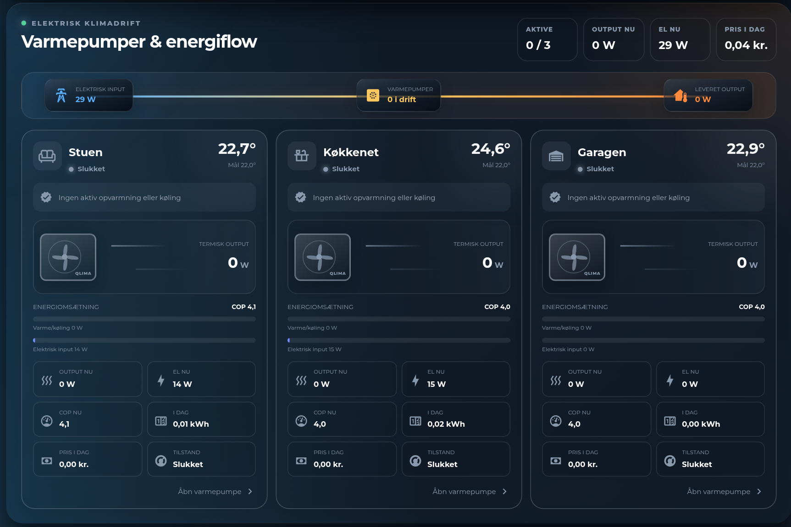

# HA Heat Pump Overview Card



A Home Assistant Lovelace card for a fleet of heat pumps / AC units: an
animated indoor-unit graphic per pump (spinning fan, airflow while active),
live thermal-output and electrical-input bars, COP, daily energy and cost —
plus a system-level flow strip summarizing total electrical input vs.
delivered output across all units.

Works with any `climate` entity for state/temperature, paired with optional
power/COP/cost sensors per pump — each metric is simply omitted when its
sensor isn't configured.

Plain JavaScript, no build step — copy the file in and register it as a
dashboard resource.

> **Note:** the card's on-screen labels are currently Danish only. There's
> no built-in translation layer yet — fork the file and edit the label
> strings directly if you need another language.

## Installation

### HACS (custom repository)

1. In HACS, go to **Frontend** → the three-dot menu → **Custom repositories**.
2. Add `https://github.com/MRDonnii/ha-heat-pump-overview-card` as type
   **Dashboard**.
3. Install **HA Heat Pump Overview Card** and add the resource if HACS
   doesn't do it automatically.

### Manual

1. Download `ha-heat-pump-overview-card.js` from the latest release (or
   this repo).
2. Copy it to
   `config/www/community/ha-heat-pump-overview-card/ha-heat-pump-overview-card.js`.
3. Add it as a dashboard resource:
   ```yaml
   url: /local/community/ha-heat-pump-overview-card/ha-heat-pump-overview-card.js
   type: module
   ```

## Usage

Add the card via the dashboard editor (search for "Heat Pump Overview") or
in YAML:

```yaml
type: custom:ha-heat-pump-overview-card
title: Heat pumps
total_output: sensor.heat_pumps_total_output
total_cost: sensor.heat_pumps_cost_today
pumps:
  - name: Living room
    climate: climate.living_room_heat_pump
    brand: Mitsubishi
    output: sensor.living_room_heat_pump_output
    input: sensor.living_room_heat_pump_power
    cop: sensor.living_room_heat_pump_cop
    daily_energy: sensor.living_room_heat_pump_daily_energy
    daily_cost: sensor.living_room_heat_pump_daily_cost
    max_output: 5000
    max_input: 1500
  - name: Garage
    climate: climate.garage_heat_pump
```

Only `name` and `climate` are required per pump.

## Configuration reference

| Key | Description |
|---|---|
| `title` | Card header text |
| `total_output` | Sensor (W) — combined thermal output, shown in the header and flow strip |
| `total_cost` | Sensor — combined cost today, shown in the header |
| `animation` | Toggle CSS animations (default `true`) |
| `pumps` | List of pump objects, see below |

### Pump object

| Key | Description |
|---|---|
| `name` | Pump label (required) |
| `climate` | `climate` entity — required; drives state, current/target temperature and the more-info link |
| `icon` | MDI icon (default `mdi:heat-pump`) |
| `brand` | Optional label printed on the unit graphic (e.g. `"Mitsubishi"`) — omitted if not set |
| `output` | Sensor (W) — thermal output |
| `input` | Sensor (W) — electrical power draw |
| `cop` | Sensor — coefficient of performance |
| `daily_energy` | Sensor (kWh) — energy used today |
| `daily_cost` | Sensor — cost accrued today |
| `max_output` | Scale ceiling (W) for the output bar (default `5000`) |
| `max_input` | Scale ceiling (W) for the input bar (default `1500`) |

Clicking a pump card (or its **Åbn varmepumpe** button) opens the pump's
`climate` entity more-info dialog.

## License

MIT — see [LICENSE](LICENSE).
The visual card editor provides entity pickers and add/remove controls for heat
pumps.
